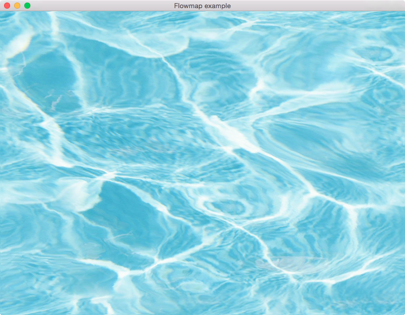

# Sabahinator

`git clone  --recursive https://github.com/1337programming/sabahinator.git`

A Rust OpenGL Example Demo

This repository contains a number of examples of using modern OpenGL in Rust using the gfx-rs library. The examples are ports of the [OpenGL Wikibook](https://en.wikibooks.org/wiki/OpenGL_Programming).

Libraries:
 - OpenGL management through the [gfx-rs][] project.
 - Window management via [glutin][].
 - Linear algebra using [cgmath][].
 - Timing functions using [time][].

[gfx-rs]: https://github.com/gfx-rs/gfx
[glutin]: https://github.com/tomaka/glutin
[cgmath]: https://github.com/brendanzab/cgmath
[time]: https://github.com/rust-lang-deprecated/time


## Screenshot



The examples build with cargo:

``` bash
cargo run --example main
```
